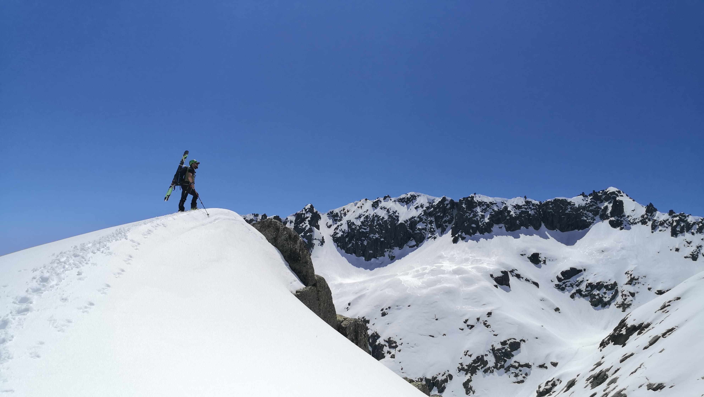
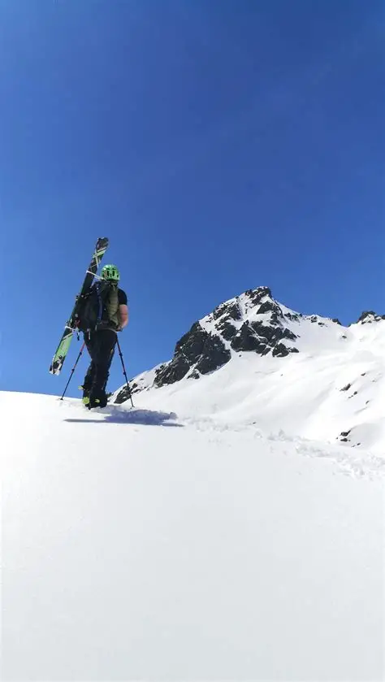

<!-- Profile README for juangcarmona -->

<h1 align="center">Hi, I'm Juan G. Carmona </h1>
<h3 align="center">
  Software & AI Architect • Secure Systems • Cloud & DevOps • Mentor & Coach
</h3>

  
  
  

## About Me
Architecting **AI-driven** and **cloud-native platforms** for high-stakes environments: motorsport, defence, mobility and enterprise systems.

 
    

    

    

- **AI Architecture:** agentic runtimes, retrieval pipelines, tool orchestration, OpenAI-compatible APIs.
- **Cloud-Native & DevSecOps:** Azure, containers, IaC, CI/CD, observable systems.
- **Secure-by-Design:** identity-first, least privilege, hardened telemetry and resilient architectures.
- **Technical Leadership:** platform strategy, system design, mentoring and execution under real constraints.

I help companies, from startups to enterprises, ship **reliable, secure and cost-aware** systems.

  

## 🚀 Selected Impact

- **[600× performance boost in ML workloads](https://medium.com/@kshilovskiy/scalable-ml-with-azure-kubernetes-and-keda-generating-inputs-with-500-pods-cde66cabf950)** using AKS + KEDA (500+ dynamic pods) in a motorsport analytics environment.
- **[Architect of Mastria (Alstom Smart Mobility PoC)](https://marketplace.microsoft.com/en-us/product/saas/alstomtransport.alstom_mastria?tab=overview)** - MVP that led to a dedicated R&D unit.
- **Mission Planning Systems ([Airbus Defence & Space](https://www.airbus.com/en/products-services/defence))** - contributed to NATO-classified A400M software under strict traceability and security constraints.
- **Enterprise legacy modernization ([Solera VIN Platform](https://www.solera.com/))** - global VIN processing platform from monolith to modular .NET Core microservices architecture, with CI/CD and TDD adoption.
- **Founder & CTO** - cloud-native architecture, team build-out, fundraising, delivery.
- **CTO-as-a-Service** for mobility, AgTech, and automotive startups - platform strategy + DevSecOps + AI systems.

## 💡 Highlighted Projects 

- **[Sentra Brain (org)](https://github.com/sentra-brain):** Private, **modular AI platform** (LLM orchestration, RAG pipelines, agentic runtime, FastAPI gateway, React frontends, Microsoft Agent Framework). Built for **privacy-first** deployments. [https://sentrabrain.com/](https://sentrabrain.com/)
- **[Star Wars Death Star arc42 Documentation](https://github.com/juangcarmona/starwars-deathstar-arc42-documentation):** Inspired by the Star Wars universe, this project provides an **educational example of applying arc42**, a popular framework for structured software architecture documentation, to a complex system, exploring each section in detail.
- **[Mermaid Playground](https://github.com/juangcarmona/mermaid-playground):** This repository contains various examples and guides on **how to create and represent** different types of **UML and C4 diagrams using Mermaid**.
- **[FastAPI REST API Tutorial](https://github.com/juangcarmona/fastapi-rest-api-tutorial):** This repository is an example of a **RESTful API implemented with FastAPI**. It includes concepts such as DDD, Vertical Slices, Dependency Injection, Security, Swagger, and more. **NOTE: README.ms is in Spanish.**
- **[Hunting The Hunter (episode one)](https://github.com/juangcarmona/hunting-the-hunter-episode-one):** Real-world **forensic analysis** of developer-targeted **malware** disguised as a job offer.
- **[Lyra](https://github.com/juangcarmona/lyra):** Lightweight CLI tool to efficiently **download full videos or audio from YouTube** videos.

## 🏁 Industries

Automotive · Motorsport · Defence · Smart Mobility · AgTech · AI Platforms

## 👥 How I Work

- Architecture & delivery under real constraints.
- Secure-by-default design (identity, least privilege, telemetry hardening).
- Deterministic AI systems with guardrails.
- Mentorship & technical leadership.

## 🏔️ Fun Fact

Outside of tech, I’m an alpinist, climber, skydiver, and ski mountaineer. I like to push limits, both on the ground and at 3,000 meters.

  

<h2  align="center" style="font-size: xx-large;"><i>Build for today, design for tomorrow, and never stop exploring.</i></h2 >

